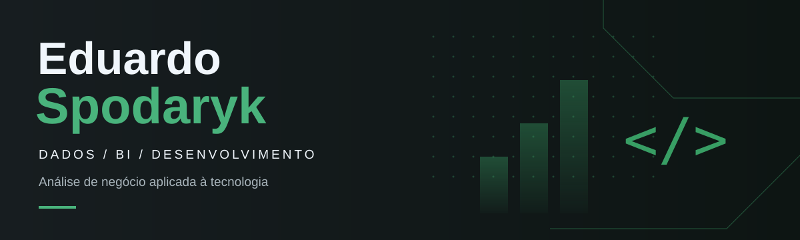

  

  <strong>Business Intelligence • Análise de Dados • Desenvolvimento</strong>

  Experiência de negócio aplicada a dados, automação e soluções de software.

---

## Sobre mim

Minha experiência profissional combina negócio e tecnologia.

Atuei com marketing de performance, trabalhando com campanhas, indicadores, dashboards e análise de resultados. Foi nesse ambiente que dados passaram a fazer parte da minha rotina profissional e da tomada de decisão.

Meu contato com programação começou ainda na adolescência. Hoje, venho aprofundando essa base em **Business Intelligence, análise de dados e desenvolvimento**, criando projetos voltados a problemas reais de operações, vendas, financeiro e produção.

Também trabalhei no setor de corte de uma indústria têxtil. Essa experiência aparece em alguns dos projetos deste portfólio, principalmente nos relacionados a **produção, conferência de lotes, qualidade e análise de perdas**.

A proposta deste GitHub é mostrar não apenas as tecnologias que utilizo, mas principalmente **como transformo um problema em uma solução**.

---

## Tecnologias e ferramentas

### Dados e Business Intelligence

  
  
  
  
  

### Desenvolvimento

  
  
  
  
  

---

## Projeto em destaque

### Francis Joias · Business Intelligence

  
  

Projeto de Business Intelligence desenvolvido para simular a análise de uma operação de venda de joias por revendedoras.

O dashboard reúne informações de **vendas, produtos, pedidos, parcelas, recebimentos e desempenho comercial**, permitindo acompanhar a operação a partir de diferentes perspectivas.

**Problema**

Uma operação com diversas revendedoras precisa acompanhar não apenas quanto vende, mas também produtos, recebimentos, parcelas, desempenho individual e evolução financeira.

**Solução**

Estruturação de um modelo analítico no Power BI para transformar esses dados em indicadores e análises úteis para acompanhamento da operação.

**No projeto**

- Modelagem e transformação de dados
- Power Query
- Medidas e indicadores em DAX
- Análise de vendas e ticket médio
- Análise de produtos
- Acompanhamento de parcelas e recebimentos
- Desempenho de revendedoras
- Navegação entre diferentes áreas do negócio

As páginas de **Visão Geral** e **Vendas** já foram desenvolvidas. As áreas de **Financeiro, Estoque e Revendedoras** continuam em evolução.

> Os dados utilizados no projeto são fictícios.

---

## Projetos selecionados

Os projetos abaixo foram construídos em torno de problemas de negócio, operações, produção e qualidade de dados.

| Projeto | Tecnologia | Problema trabalhado |
| --- | --- | --- |
| [Conferência de lotes do corte](https://github.com/EduardoSpodaryk/conferencia_de_lotes) | Pascal | Comparar peças previstas, aprovadas e rejeitadas durante a conferência de um lote. |
| [Guia visual de defeitos têxteis](https://github.com/EduardoSpodaryk/guia-visual-defeitos-texteis) | HTML e CSS | Padronizar a consulta de defeitos e critérios utilizados durante uma inspeção. |
| [Painel de exceções de pedidos](https://github.com/EduardoSpodaryk/painel-excecoes-pedidos) | React, HTML e CSS | Centralizar pedidos que precisam de análise ou intervenção antes de seguir no processo. |
| [Auditor de arquivos de vendas](https://github.com/EduardoSpodaryk/auditor-arquivos-vendas) | Python | Identificar inconsistências em arquivos antes que os dados sejam utilizados em análises e relatórios. |
| [Análise de produção e perdas do corte](https://github.com/EduardoSpodaryk/analise-producao-corte-sql) | SQL | Investigar produção, desperdícios, perdas e retrabalho em um cenário industrial. |

---

## O que conecta esses projetos?

Apesar de utilizarem tecnologias diferentes, os projetos seguem a mesma lógica:

**entender o problema → organizar os dados ou processo → desenvolver a solução → transformar o resultado em informação útil.**

É essa interseção entre **negócio, dados e tecnologia** que estou buscando aprofundar profissionalmente.

---

  Santa Catarina, Brasil

